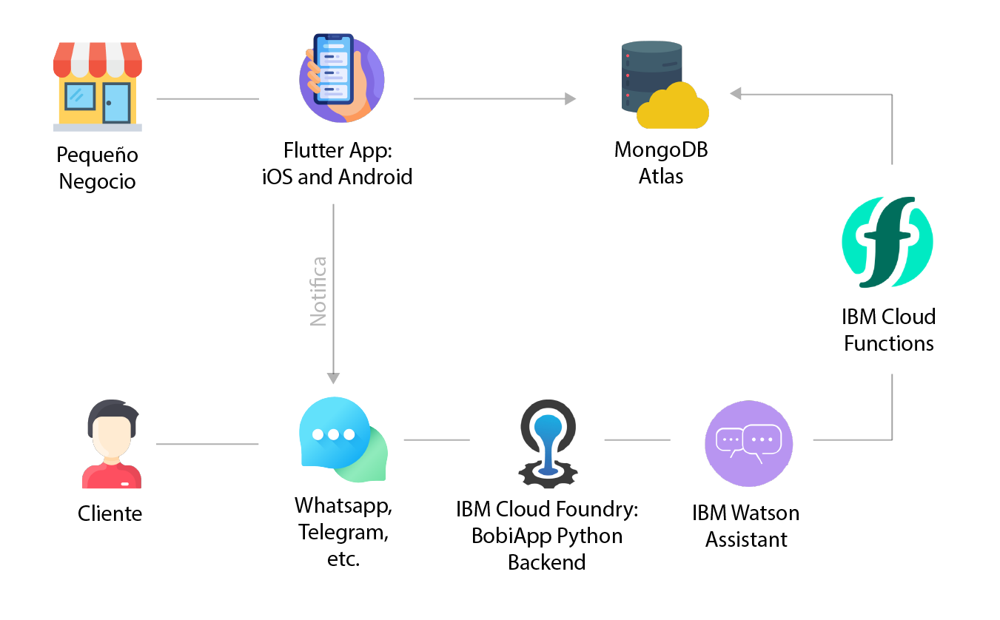
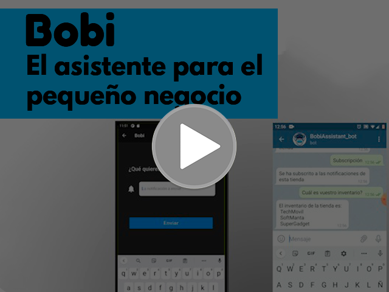

<!-- PROJECT LOGO -->
<h2>Equipo: TrioFundador</h2>
 

  

<h4>

    Repositorio dedicado a la parte de funciones cloud.
  </h4>
   
  

    Bobi es un asistente inteligente para el pequeño negocio.
   
  Maneja inventario, preguntas frecuentes, notifica a tus usuarios y mucho más!
     
    <a href="#"><strong>Documentación »</strong></a>
     
     
    <a href="#">Demo</a>
    ·
    <a href="https://github.com/lloretalvaro/Bobi_app/issues">Reportar Bug</a>
    ·
    <a href="https://github.com/lloretalvaro/Bobi_app/issues">Sugerir mejora</a>
  

<!-- TABLE OF CONTENTS -->

  
Índice

  <ol>
    <li>
      <a href="#sobre-el-proyecto">Sobre el proyecto</a>
      <ul>
        <li><a href="#el-problema">El problema</a></li>
        <li><a href="#nuestra-solución">Nuestra solución</a></li>
        <li><a href="#demo">Demo</a></li>
      </ul>
    </li>
    <li>
      <a href="#getting-started">Instalación rápida</a>
      <ul>
        <li><a href="#deploy">Deploy</a></li>
      </ul>
    </li>
    <li><a href="#licencia">Licencia</a></li>
  </ol>

<!-- ABOUT THE PROJECT -->
# Sobre el Proyecto
## El Problema

En la actualidad la gente no quiere salir de su casa sin saber si el producto que va a comprar está disponible. Los pequeños/medianos negocios no pueden ofrecer atención personalizada a sus clientes para resolver sus problemas. Además muchos clientes no se sienten cómodos haciendo preguntas recurrentes o que puedan poner en un apuro a los dueños.

### Nuestra Solución

Ofrecemos una herramienta que permite a los clientes hacer consultas sobre el negocio o sus productos que sean contestadas al instante ahorrando tiempo a los dueños para que lo dediquen a su negocio. Utilizando el procesamiento del lenguaje natural podrá comprobar el inventario de la tienda, realizar reservas, resolver dudas, notificar a los clientes sobre nuevas remesas de productos y hacer recomendaciones de forma inteligente en base a los artículos ofertados (recetas, outfits, reviews, ...).

### Tecnologías utilizadas

El proyecto se ha basado sobretodo en el  uso de microservicios proporcionados por el Cloud IBM. A continuación se muestra un diagrama de arquitectura de nuestra aplicación.

### Demo

<!-- GETTING STARTED -->
## Getting started

### Deploy

La aplicación está ya preparada para hacer deploy en las tiendas de iOS y Android. Además, si hubiera interés se podría hacer también para versiones de escritorio.

<!-- LICENSE -->
## Licencia

To be determined.

